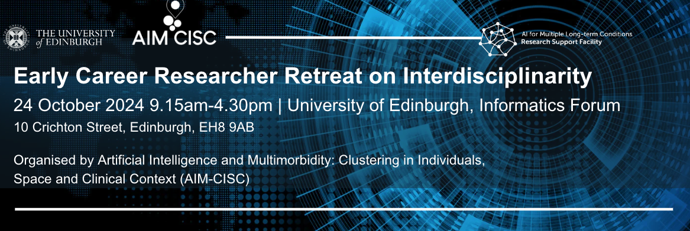

# Interdisciplinary Workshop for Early Career Researchers at The University of Edinburgh

**About**

From AIM-CISC, with the support of the AIM RSF, we are happy to host an Early Career Researcher (ECR) Day around the topic of Interdisciplinarity on the 24th of October 2024 at the Informatics Forum, University of Edinburgh.
In this event we will delve into
- what is interdisciplinary research,
- what institutional structures facilitate interdisciplinary collaboration,
- and what skills are needed for making cross-disciplinary collaborations effective.
As we all have a great deal of experience from our AIM projects on what working in an interdisciplinary project involves, we will also use the workshop to reflect and share the challenges, solutions, and lessons learned from it.

The event will be hybrid. We can host up to 30 in-person attendees, with budget to pay for travel (up to £200) and accommodation for up to 25 attendees. Registration can be done until the 12th of September [here](https://forms.gle/1fqM9RHPExLBodS69).

**Schedule**

- **Location:** Informatics Forum, 10 Crichton St, Newington, Edinburgh EH8 9AB, https://maps.app.goo.gl/FZBVN32RvKm66ZWZ8. (Fully accessible building.) The Informatics Forum is conveniently located at the Central Campus of the University of Edinburgh, just 15 minutes to Edinburgh Waverly Train Station.
- **Date and Time:** 24th October 2024, from 9:15 AM to 4:20 PM

| Time  | Session                                                   | Facilitator    |
| ----- | --------------------------------------------------------- | -------------- |
| 09:15 | Ice-breaker & Opening remakrs                             | Guillermo      |
| 10:00 | Interdisciplinarity workshop I                            | Anna Pilz      |
| 11:00 | Comfort break                                             |                |
| 11:10 | Reflection & sharing of interdisciplinarity experience    | Guillermo      |
| 12:10 | Lunch                                                     |                |
| 13:15 | Bazaar for discussion around specific topics              | Imane Guellil  |
| 14:15 | Comfort break                                             |                |
| 14:30 | Interdisciplinary workshop II                             | Verena Knerich |
| 16.00 | Comfort break                                             |                |
| 16:10 | Wrap up & Closing remarks                                 | Guillermo      |
| 16:20 | The End                                                   |                |

## Funding guidelines

**The workshop, accommodation, and transport (up to £200, inclusive of VAT) are fully funded.** The AI for Multiple Long Term Conditions Research Support Facility can provide support with costs for travel and the AIM-CISC team will be organising accommodation (for a maximum of 1 night if requested in the registration form). There is also an accessibility fund which can support additional travel or other costs, to help facilitate attendance for those who may need it.

We can't arrange the travel directly, so ECRs will have to arrange their own travel and request reimbursement (within **2 weeks** after the event). All travel should be in compliance with [The Alan Turing Institute’s internal Travel and Expenses Policy](https://az659834.vo.msecnd.net/eventsairwesteuprod/production-uobevents-public/55742e599b004367b24d306d7ad73916).

Full information on the travel and accommodation funding guidelines and requesting reimbursement can be found [here](https://docs.google.com/document/d/1gzVB4cKMg4jXUPmFYvEs-osCxxMS9w8Mxc1YpbCrgjo/edit#heading=h.fmuzkahh3sk5).

## Organisation
**Organising committee at AIM-CISC**
- **Guillermo Romero Moreno**, Chair
- **Imane Guellil**, Communication
- **Paola Galdi**, Venue
- **Chunyu Zheng**, Accommodation
- **Janice Murray, Stella Arakelyan, Eleojo Abubakar, Jake Palmer**, Support
- **Lucy McCloughan & Louise Hartley**, legal & finance
- **Ailsa Barclay & Gregor Hall**, admin support

This event is being co-organised with the AI for Multiple Long Term Conditions Research Support Facility, hosted by the Alan Turing Institute. (Thanks **Batool** and the **AIM RSF team** for all the help.)

Many thanks to **Verena Knerich** for delivering the training session at the event and for providing lots of valuable feedback on the planning of the program and materials for the activities. Many thanks to **Anna Pilz** and the **Institute of Academic Development** at the University of Edinburgh for providing part of the interdisiclinarity training.
